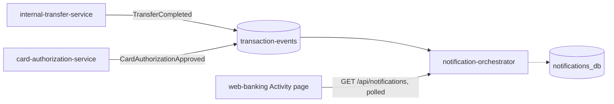

# Event-driven architecture: the transaction-events topic

This document is the living reference for how this platform's first (and
so far only) piece of event-driven architecture actually works day to day.
[ADR-0003](architecture-decisions/ADR-0003-event-bus.md) is the point-in-time
record of *why* it's shaped this way and what alternatives were considered
— read that first if you're asking "why not X"; read this one if you're
asking "how does this actually work" or "how do I add a third producer or
consumer."

## The shape of it



One Kafka topic, two producers, one consumer. Both producers publish onto
`transaction-events` after — never before, never as part of — the same
database transaction that already committed the customer-visible outcome
(a COMPLETED Transfer, an APPROVED CardAuthorization). Nothing upstream of
either publish call knows or cares whether Kafka is running.

## The topic

`transaction-events` — see
[`messaging/kafka/topics/transaction-events.yaml`](../../messaging/kafka/topics/transaction-events.yaml)
for the concrete config (3 partitions, replication factor 1, 7-day
retention) and the full list of event types it carries. Both event types
share a topic and are told apart by an `eventType` field rather than each
getting a dedicated topic — see ADR-0003's "Alternatives considered" for
why, and for the condition under which that should change.

## Producers

Both publishers follow an identical shape, each in its own service's
`event` package (no shared Java type — see ADR-0003):

| Service | Publisher class | Event | Published when |
| --- | --- | --- | --- |
| `internal-transfer-service` | `TransferEventPublisher` | `TransferCompleted` | A `Transfer` is saved with status `COMPLETED` |
| `card-authorization-service` | `CardAuthorizationEventPublisher` | `CardAuthorizationApproved` | A `CardAuthorization` is saved with status `APPROVED` |

Both:

- Are called from their owning service (`TransferService`,
  `CardAuthorizationService`) immediately after the outcome is known,
  never from inside the `REQUIRES_NEW` execution-service transaction that
  decides the outcome (`TransferExecutionService`,
  `CardAuthorizationExecutionService`) — the event describes something
  that already happened and was already committed.
- Serialize the event to a JSON string with Jackson and call
  `KafkaTemplate<String, String>.send(topic, key, payload)`, keyed by the
  transfer/authorization id.
- Catch every exception the send can produce — both a synchronous client
  error and an asynchronous failure delivered via the returned
  `CompletableFuture` — and only log a warning. See each class's own
  Javadoc for the full reasoning; the short version is FR-3 in
  `docs/product/frd-event-driven-notifications.md`: a Kafka problem must
  never become an API-visible problem.

## Consumer

`services/notifications/notification-orchestrator` is the only consumer
today. `TransactionEventListener` (`@KafkaListener(topics =
"transaction-events", groupId = "notification-orchestrator")`) receives
each raw JSON message, hands it to `TransactionEventParser` (which
dispatches on `eventType` to build a `ParsedTransactionEvent` — see that
class's Javadoc for how to add a third event type), and passes the result
to `NotificationService.recordEvent`, which saves a `NotificationRecord`
unless one already exists for that `eventId`.

A message the parser can't make sense of (malformed JSON, an unrecognized
`eventType`, a missing expected field) is logged and dropped, not retried
— see `TransactionEventListener`'s Javadoc for what that trades away and
why it's an acceptable trade for what this consumer does today.

`GET /api/notifications` on `notification-orchestrator`, routed through
the gateway at `/api/notifications/**`, serves the 50 most recent records
back out — the only way in or out of this service besides the Kafka
listener itself. `web-banking`'s Activity page polls this every 5 seconds.

## Delivery guarantees, plainly stated

- **At-least-once, best-effort.** A transaction can commit and never have
  its event published (Kafka down at that instant) — see ADR-0003. A
  published event can be delivered to the consumer more than once (e.g.
  after a consumer-group rebalance).
- **Consumer-side duplicate protection is a unique constraint, not a full
  idempotent-consumption design.** `notification_records.event_id` is
  unique; `NotificationService.recordEvent` checks first and the
  constraint is the real backstop against a race. That's sufficient
  because writing the row *is* this consumer's only side effect — it
  stops being sufficient the moment a consumer does something with an
  external side effect (send an email, call another service) that can't
  simply be re-checked-and-skipped the same way; see ADR-0003's dedup
  bullet.
- **No transactional outbox.** The commit-then-crash window between
  "Transfer saved COMPLETED" and "event published" is real and
  unaddressed in this release.
- **No schema registry.** Every producer and consumer of this topic lives
  in this one repository today; if that stops being true, revisit this
  (see ADR-0003).

## Running it locally

`docker compose up --build` from `deployment/docker` starts the Kafka
broker (service name `kafka`, KRaft mode, single node) alongside
everything else — no separate step. To watch the topic directly:

```bash
docker compose exec kafka /opt/kafka/bin/kafka-console-consumer.sh \
  --bootstrap-server localhost:9092 --topic transaction-events --from-beginning
```

To run `notification-orchestrator` standalone against a broker already
running via docker-compose, see its own README.

## What to build next

In roughly increasing order of effort, if you want to keep extending this:

1. **A second consumer** of `transaction-events` — fraud scoring or
   reporting are the two the PRD names as motivating examples. Since
   Kafka consumer groups are independent, this needs no change to either
   publisher or to `notification-orchestrator`.
2. **Real notification delivery** — have `notification-orchestrator` (or
   a new sibling service) actually send an email/SMS/push instead of only
   recording a row. See `docs/domains/notifications.md` for why this
   needs an idempotency/dedup upgrade first (NOTIF-11 in
   `docs/product/notifications-backlog.md`), since sending mail can't be
   "skipped and re-checked" the way saving a row can.
3. **A transactional outbox** in the two publishing services, closing the
   commit-then-crash gap named above (NOTIF-5 in the backlog).
4. **Split `transaction-events` into per-producer topics** once a second
   consumer wants one event type but not the other (see ADR-0003's
   "Alternatives considered").
