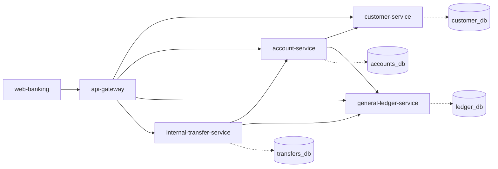
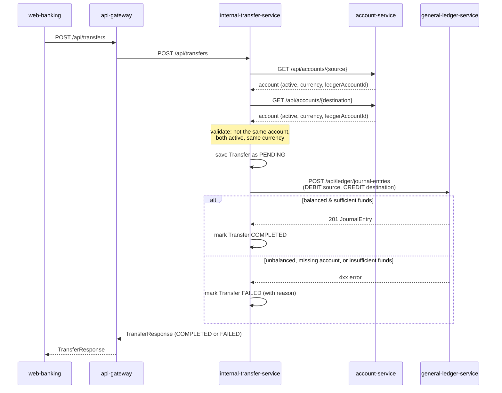

# Vertical slice: onboarding → open account → transfer

This document explains the one working, end-to-end path built through the
fintech-platform scaffold, why it's shaped the way it is, and what's
deliberately left as a stub for later.

## Why a vertical slice, not everything at once

The full scaffold describes 17 top-level service *categories* (customer,
accounts, transfers, cards, lending, trading, ...), each further split into
several specific microservices (e.g. `services/accounts` alone contains
seven: opening, closing, statements, limits, status, an account-level
ledger view, and general account CRUD) — plus 6 frontend apps, an ML
platform, a data platform, and complete infra/observability/security
tooling. It's a multi-month effort for a real team. Building one real,
runnable path through the system teaches the important lessons (service
boundaries, inter-service contracts, the double-entry bookkeeping
invariant, resilience when a downstream call fails) without spending all
the effort on scaffolding that never runs. Everything here is meant to be a
template you extend the same way for the next slice — a new product
(cards, lending), not a new architecture.

## What's actually implemented

| Component | Location | Responsibility |
|---|---|---|
| `customer-service` | `services/customer/customer-service` | Owns customer identity and a simplified KYC status. |
| `account-service` | `services/accounts/account-service` | Opens and tracks bank accounts; owns "which accounts exist," not balances. |
| `general-ledger-service` | `ledger/general-ledger-service` | The general ledger: enforces double-entry bookkeeping, computes balances. |
| `internal-transfer-service` | `services/transfers/internal-transfer-service` | Orchestrates moving money between two accounts; owns the transfer lifecycle. |
| `api-gateway` | `gateways/api-gateway` | Single entry point + CORS for the demo UI; routes to the four services above. |
| `web-banking` | `apps/web-banking` | Vite + React + TypeScript demo UI exercising the whole flow in a browser. |

Note this slice consolidates what the fuller scaffold names as several
separate microservices into one each — e.g. `account-service` here also
does what `account-opening-service` was named for, and
`internal-transfer-service` is the only one of the six transfer-type
services (domestic, wire, international, scheduled, beneficiary,
internal) actually built. Every other folder in the scaffold (cards,
lending, trading, the ML platform, Kubernetes manifests, Terraform, the
other ledger sub-services, the other accounts/transfers microservices,
etc.) is untouched — still just the empty directory structure it started
as.

## Service boundaries and why they're drawn here

Each service owns one database — no service reads another's tables
directly, only its HTTP API. That's what makes it possible to deploy,
scale, or even rewrite one service without touching the others, and it's
also why every cross-service call in this codebase goes through a small
`*Client` class wrapping a `RestClient`, never a shared JPA entity.

`general-ledger-service` never calls out to any other service. It's the one place
double-entry bookkeeping is enforced, and it stays reusable across any
future product (cards, lending, trading) precisely because it doesn't know
what an "account owner" or a "transfer" is — only postings, and that they
must balance.

## The transfer flow end-to-end

Two things worth noticing:

1. **A 201 response doesn't mean the money moved.** It means the request to
   *attempt* a transfer was well-formed. The transfer's `status` field is
   how the caller learns whether it actually completed — a FAILED transfer
   is still a successful API call, and it's still saved, because "we tried
   and it didn't work" needs an audit trail as much as a success does.
2. **Debits equal credits is enforced in the domain model itself**, not in
   a validation step someone could forget to call — see
   `JournalEntry`'s constructor in `general-ledger-service`. It's structurally
   impossible to persist an unbalanced entry.

## The frontend

`apps/web-banking` already had empty Vite + React + TypeScript scaffolding
(`src/pages/*`, `src/api`, `src/services`, `src/stores`, etc.) before this
slice touched it. Rather than build a separate static site, the demo UI was
built to fit that shape:

| Folder | Used for |
|---|---|
| `src/api` | Raw HTTP wrappers, one file per backend service, plus the shared `apiRequest`/`ApiError` client. |
| `src/services` | Composition logic that doesn't need React (e.g. `accountService.fetchAccountsWithBalances` fans out "list accounts" + "get balance per account" into one call). |
| `src/stores` | Two React Contexts: `DirectoryContext` (the local, browser-only memory of which customers/accounts you've created — never a cache of server truth) and `ToastContext`. |
| `src/pages/{dashboard,profile,accounts,payments,transactions}` | The five pages this slice implements. `profile` doubles as "onboard a customer / switch active customer" since the scaffold has no dedicated onboarding page. `payments` hosts the transfer form; `transactions` hosts transfer history — there's no backend service behind either name, they're just the closest fit in the existing page list. |
| `src/pages/{cards,investments,loans,security,statements,support}` | Untouched — still just their placeholder `README.md`. |
| `src/tests/unit` | Vitest + React Testing Library tests for the format utils, `StatusPill`, `DirectoryContext`, and the HTTP client's error handling. |

Unlike the backend, this app was actually built, linted, and tested in the
environment that produced it (`npm run build`, `npm run lint`, `npm test`
all pass) — see the README's note on why the same isn't true of the Java
services.

## Simplifications made on purpose (and what real would look like)

- **REST instead of async messaging.** Every inter-service call here is a
  synchronous HTTP request. A production system would likely use the
  `messaging/kafka` piece of this scaffold for at least the
  transfer-completed event, so other services (notifications, fraud,
  reporting) can react without internal-transfer-service knowing they exist. This
  slice keeps it synchronous so the whole flow is easy to trace in one
  request.
- **No saga/outbox pattern.** `internal-transfer-service` calling `general-ledger-service`
  and updating its own status afterward is a simplified stand-in for the
  real distributed-transaction problem. If the process crashed between
  posting to the ledger and saving COMPLETED, you'd have a ledger entry
  with no matching transfer record. A production system needs an outbox
  table or a reconciliation job to catch that — worth building next.
- **`account-service` exposes its internal `ledgerAccountId`** in
  `AccountResponse` so `internal-transfer-service` can call the ledger directly.
  A stricter boundary would keep that id internal and have
  `internal-transfer-service` ask `general-ledger-service` to resolve it by owner
  reference instead. Simplified here to avoid a fifth network hop per
  transfer.
- **Single-currency transfers only.** `internal-transfer-service` rejects a
  transfer between accounts in different currencies rather than doing any
  FX conversion.
- **KYC is a fake age check.** `customer-service` approves anyone 18+ and
  rejects anyone younger — a real bank calls out to document verification
  and sanctions-screening providers (see `integrations/identity`,
  `integrations/credit-bureaus` in the scaffold).
- **No auth.** Every endpoint is open. `security/authentication` and
  `security/authorization` are still empty — a real system would put OAuth2
  / JWT validation at the gateway and short-lived service-to-service
  tokens between services.

## Running it

See the root `README.md` for the quickstart. In short:
`cd deployment/docker && docker compose up --build`, then open
`http://localhost:3000`.

## What to build next

If you want to keep extending this slice, in roughly increasing order of
effort:

1. **Split the ledger** into the sub-services the scaffold already names
   (`journal-service`, `posting-service`, `balance-service`,
   `reconciliation-service`) — `general-ledger-service` as built here does all four
   jobs in one process, which is a reasonable starting point but not how
   the folder names suggest the target architecture looks.
2. **Add `services/cards` or `services/lending`** following the same
   pattern: its own database, its own `*Client` wrappers for the services
   it depends on, its own Flyway migrations.
3. **Publish a `TransferCompleted` event** to `messaging/kafka` and have a
   new, tiny `services/notifications` consumer log it — the smallest
   possible taste of event-driven architecture before committing to it
   everywhere.
4. **Add authentication** at `gateways/api-gateway` so the demo UI has to
   log in, and pass a validated identity down to the services.

None of the four items above need new environment plumbing to land in --
dev/staging/uat/production are already wired up (Spring profiles, Docker
Compose, Kubernetes overlays, Terraform, CI/CD) for whatever this vertical
slice grows into next. See `docs/operations/deployment.md`.
