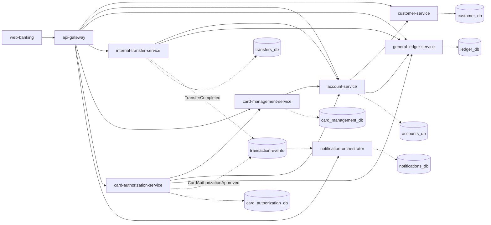
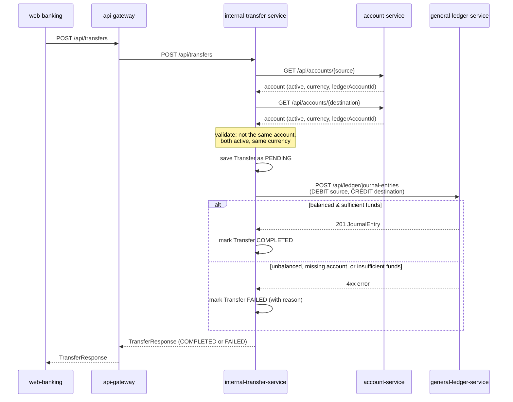
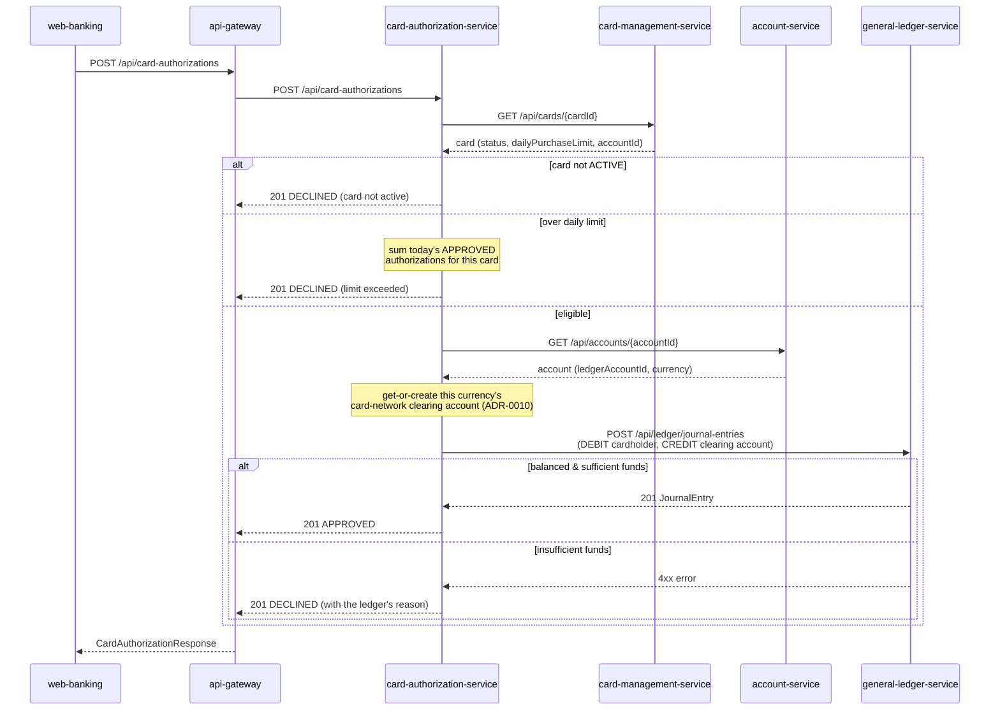
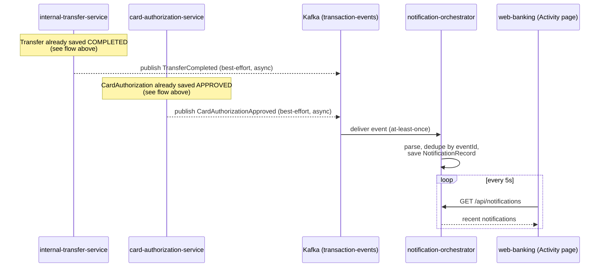

# Vertical slices: onboarding → open account → transfer, and cards → authorization

This document explains the working, end-to-end paths built through the
fintech-platform scaffold, why they're shaped the way they are, and what's
deliberately left as a stub for later. There are two: the original
money-movement slice (customer → account → ledger → transfer), and a
second one built on top of it (a debit card → real-time purchase
authorization → the same ledger). See
[`docs/product/prd-card-issuance-and-authorization.md`](../product/prd-card-issuance-and-authorization.md)
for why the second slice exists and
[ADR-0010](architecture-decisions/ADR-0010-card-network-clearing-account.md)
for its one new architectural decision.

A third piece sits on top of both, but isn't a third *slice* in the same
sense — it's platform infrastructure, not a new customer-facing domain:
both slices' completion events (`TransferCompleted`,
`CardAuthorizationApproved`) now publish to Kafka, consumed by a new
`notification-orchestrator` service. See
[`docs/architecture/event-driven-architecture.md`](event-driven-architecture.md)
for how it works and
[ADR-0003](architecture-decisions/ADR-0003-event-bus.md) for why.

## Why a vertical slice, not everything at once

The full scaffold describes 17 top-level service *categories* (customer,
accounts, transfers, cards, lending, trading, ...), each further split into
several specific microservices (e.g. `services/accounts` alone contains
seven: opening, closing, statements, limits, status, an account-level
ledger view, and general account CRUD) — plus 6 frontend apps, an ML
platform, a data platform, and complete infra/observability/security
tooling. It's a multi-month effort for a real team. Building one real,
runnable path through the system teaches the important lessons (service
boundaries, inter-service contracts, the double-entry bookkeeping
invariant, resilience when a downstream call fails) without spending all
the effort on scaffolding that never runs. Everything here is meant to be a
template you extend the same way for the next slice — a new product
(cards, lending), not a new architecture.

## What's actually implemented

| Component | Location | Responsibility |
|---|---|---|
| `customer-service` | `services/customer/customer-service` | Owns customer identity and a simplified KYC status. |
| `account-service` | `services/accounts/account-service` | Opens and tracks bank accounts; owns "which accounts exist," not balances. |
| `general-ledger-service` | `ledger/general-ledger-service` | The general ledger: enforces double-entry bookkeeping, computes balances. |
| `internal-transfer-service` | `services/transfers/internal-transfer-service` | Orchestrates moving money between two accounts; owns the transfer lifecycle. |
| `card-management-service` | `services/cards/card-management-service` | Issues debit cards against an account and tracks their lifecycle (ISSUED/ACTIVE/BLOCKED). |
| `card-authorization-service` | `services/cards/card-authorization-service` | Real-time purchase authorization: card status + daily limit checks, then a balanced ledger posting. |
| `notification-orchestrator` | `services/notifications/notification-orchestrator` | Consumes both slices' completion events off Kafka and records them for an activity feed — see below. |
| `api-gateway` | `gateways/api-gateway` | Single entry point + CORS for the demo UI; routes to all seven services above. |
| `web-banking` | `apps/web-banking` | Vite + React + TypeScript demo UI exercising both flows, plus the activity feed, in a browser. |

Note both slices consolidate what the fuller scaffold names as several
separate microservices into one each — e.g. `account-service` here also
does what `account-opening-service` was named for,
`internal-transfer-service` is the only one of the six transfer-type
services (domestic, wire, international, scheduled, beneficiary,
internal) actually built, `card-management-service` consolidates
`card-issuance-service` and `card-activation-service`, and
`card-authorization-service` consolidates `card-authorization-service`
and `card-transaction-service` (the scaffold's own names — this repo's
`card-authorization-service` folder is the built one).
`notification-orchestrator` is the exception: it's the one service under
`services/notifications/` this platform has built, and it's not a
consolidation of several scaffolded names — the scaffold only ever named
one service in that category. Every other folder in the scaffold (lending,
trading, the ML platform, Kubernetes manifests, Terraform, the other
ledger sub-services, the other accounts/transfers/cards microservices,
etc.) is untouched — still just the empty directory structure it started
as.

## Service boundaries and why they're drawn here

Each service owns one database — no service reads another's tables
directly, only its HTTP API. That's what makes it possible to deploy,
scale, or even rewrite one service without touching the others, and it's
also why every cross-service call in this codebase goes through a small
`*Client` class wrapping a `RestClient`, never a shared JPA entity.
`card-management-service` and `card-authorization-service` follow the
identical pattern the first slice established — neither one was given
special-case plumbing to fit in. `notification-orchestrator` is the one
exception to "every cross-service call is a `*Client` wrapping a
`RestClient`": it never calls another service's HTTP API at all, and
nothing calls its API either except read-only GETs from the browser — its
only inbound integration point is the Kafka topic. See
[`docs/architecture/event-driven-architecture.md`](event-driven-architecture.md)
for that flow specifically.

`general-ledger-service` never calls out to any other service. It's the one place
double-entry bookkeeping is enforced, and it stays reusable across any
future product (cards, lending, trading) precisely because it doesn't know
what an "account owner", a "transfer", or a "card" is — only postings, and
that they must balance. Proving that reuse was the whole point of building
the cards slice second: `general-ledger-service` and `account-service` were
not touched at all to support it (see the PRD's Success Metrics).

## The transfer flow end-to-end

Two things worth noticing:

1. **A 201 response doesn't mean the money moved.** It means the request to
   *attempt* a transfer was well-formed. The transfer's `status` field is
   how the caller learns whether it actually completed — a FAILED transfer
   is still a successful API call, and it's still saved, because "we tried
   and it didn't work" needs an audit trail as much as a success does.
2. **Debits equal credits is enforced in the domain model itself**, not in
   a validation step someone could forget to call — see
   `JournalEntry`'s constructor in `general-ledger-service`. It's structurally
   impossible to persist an unbalanced entry.

## The card authorization flow end-to-end

The shape deliberately mirrors the transfer flow above — validate, then
post a balanced entry, then report the outcome in the response body rather
than the HTTP status — but with one more layer of business rule (card
status, then a daily limit) evaluated *before* the ledger is ever
consulted, closer to how a real card network's authorization stack is
layered.

## The event-driven notifications flow end-to-end

Notice this diagram has no `alt`/`else` branch the way the two flows above
do — there's no failure path drawn from the publish step back into either
publishing service, because there structurally isn't one. `X-->>K` and
`CA-->>K` are dashed arrows on purpose: whatever happens after that call
(Kafka slow, unreachable, or the message simply never arriving) has zero
effect on the `TransferResponse` / `CardAuthorizationResponse` already
returned to the caller. See
[`docs/architecture/event-driven-architecture.md`](event-driven-architecture.md)
and [ADR-0003](architecture-decisions/ADR-0003-event-bus.md) for the full
mechanics and the guarantees this deliberately does and doesn't make.

## The frontend

`apps/web-banking` already had empty Vite + React + TypeScript scaffolding
(`src/pages/*`, `src/api`, `src/services`, `src/stores`, etc.) before this
slice touched it. Rather than build a separate static site, the demo UI was
built to fit that shape:

| Folder | Used for |
|---|---|
| `src/api` | Raw HTTP wrappers, one file per backend service, plus the shared `apiRequest`/`ApiError` client. |
| `src/services` | Composition logic that doesn't need React (e.g. `accountService.fetchAccountsWithBalances` fans out "list accounts" + "get balance per account" into one call). |
| `src/stores` | Two React Contexts: `DirectoryContext` (the local, browser-only memory of which customers/accounts you've created — never a cache of server truth) and `ToastContext`. |
| `src/pages/{dashboard,profile,accounts,payments,transactions,cards}` | The six pages the scaffold already named that these two slices implement. `profile` doubles as "onboard a customer / switch active customer" since the scaffold has no dedicated onboarding page. `payments` hosts the transfer form; `transactions` hosts transfer history; `cards` hosts card issuance/activation/blocking and a "simulate a purchase" form with its own authorization history table — there's no backend service behind the `payments`/`transactions` names, they're just the closest fit in the existing page list, while `cards` genuinely matches the two new backend services. |
| `src/pages/notifications` | The Activity page — the one page in this app with **no** matching scaffold placeholder folder, because the original page scaffold never named "notifications." Net-new, polling `GET /api/notifications` every 5 seconds; not scoped to the current customer (see `docs/domains/notifications.md`). |
| `src/pages/{investments,loans,security,statements,support}` | Untouched — still just their placeholder `README.md`. |
| `src/tests/unit` | Vitest + React Testing Library tests for the format utils, `StatusPill`, `DirectoryContext`, and the HTTP client's error handling. |

Unlike the backend, this app was actually built, linted, and tested in the
environment that produced it (`npm run build`, `npm run lint`, `npm test`
all pass, `cards` and `notifications` pages included) — see the README's
note on why the same isn't true of the Java services.

## Simplifications made on purpose (and what real would look like)

- **REST for every decision-making call; Kafka only for the "it happened"
  announcement afterward.** Every call that needs an answer before it can
  respond to its own caller (accounts-service, ledger-service,
  card-management-service) is still synchronous HTTP — that hasn't
  changed. What's new: `internal-transfer-service` and
  `card-authorization-service` each publish one event to Kafka's
  `transaction-events` topic *after* their decision is already made and
  committed, so a consumer (`notification-orchestrator` today; fraud
  scoring or reporting could be next) can react without either publishing
  service knowing or caring who's listening. See
  `docs/architecture/event-driven-architecture.md` and ADR-0003 for the
  full mechanics — this is deliberately the smallest possible step into
  that pattern, not a wholesale migration to async messaging.
- **No saga/outbox pattern.** `internal-transfer-service` calling `general-ledger-service`
  and updating its own status afterward is a simplified stand-in for the
  real distributed-transaction problem. If the process crashed between
  posting to the ledger and saving COMPLETED, you'd have a ledger entry
  with no matching transfer record. A production system needs an outbox
  table or a reconciliation job to catch that — worth building next.
- **`account-service` exposes its internal `ledgerAccountId`** in
  `AccountResponse` so `internal-transfer-service` can call the ledger directly.
  A stricter boundary would keep that id internal and have
  `internal-transfer-service` ask `general-ledger-service` to resolve it by owner
  reference instead. Simplified here to avoid a fifth network hop per
  transfer.
- **Single-currency transfers only.** `internal-transfer-service` rejects a
  transfer between accounts in different currencies rather than doing any
  FX conversion.
- **KYC is a fake age check.** `customer-service` approves anyone 18+ and
  rejects anyone younger — a real bank calls out to document verification
  and sanctions-screening providers (see `integrations/identity`,
  `integrations/credit-bureaus` in the scaffold).
- **No auth.** Every endpoint is open. `security/authentication` and
  `security/authorization` are still empty — a real system would put OAuth2
  / JWT validation at the gateway and short-lived service-to-service
  tokens between services.
- **A card purchase settles against a synthetic clearing account, not a
  real merchant.** `card-authorization-service` credits one ledger account
  per currency standing in for "the card network" rather than a real
  merchant-acquiring/interchange settlement domain — the smallest change
  that lets a purchase post a balanced entry without modifying
  `ledger-service`. See [ADR-0010](architecture-decisions/ADR-0010-card-network-clearing-account.md)
  for the full reasoning and alternatives considered.
- **A blocked card can't be unblocked**, and there's no credit-card type
  yet even though the `CardType` enum has one — both are scoped out for
  this release, not forgotten; see the PRD's Non-Goals and
  `docs/product/card-issuance-backlog.md`.

## Running it

See the root `README.md` for the quickstart. In short:
`cd deployment/docker && docker compose up --build`, then open
`http://localhost:3000`.

## What to build next

The original four-item list here has two items done. If you want to keep
extending these slices, in roughly increasing order of effort:

1. ~~Add `services/cards` or `services/lending` following the same
   pattern.~~ **Done** — `card-management-service` and
   `card-authorization-service`; see
   `docs/product/prd-card-issuance-and-authorization.md` and
   `docs/product/card-issuance-backlog.md` for what's still open within
   cards specifically (unblocking, credit cards, disputes, rewards,
   tokenization, real merchant settlement).
2. **Split the ledger** into the sub-services the scaffold already names
   (`journal-service`, `posting-service`, `balance-service`,
   `reconciliation-service`) — `general-ledger-service` as built here does all four
   jobs in one process, which is a reasonable starting point but not how
   the folder names suggest the target architecture looks.
3. **Add `services/lending`** following the same pattern as both existing
   slices: its own database, its own `*Client` wrappers for the services
   it depends on, its own Flyway migrations. A natural third slice, and
   the one that would finally give the `CardType.CREDIT` case somewhere
   real to plug into (a credit line, a repayment relationship).
4. ~~Publish a `TransferCompleted` and a `CardAuthorizationApproved` event
   to `messaging/kafka` and have a new, tiny `services/notifications`
   consumer log them.~~ **Done** — `notification-orchestrator`; see
   `docs/architecture/event-driven-architecture.md`, ADR-0003, and
   `docs/product/notifications-backlog.md` for what's still open (real
   delivery channels, a transactional outbox, a second consumer, per-topic
   splitting).
5. **Add authentication** at `gateways/api-gateway` so the demo UI has to
   log in, and pass a validated identity down to every service, cards and
   notification-orchestrator included.
6. **A second `transaction-events` consumer** — fraud scoring or
   reporting, per the notifications PRD's own motivating examples — is now
   the cheapest way to prove the event bus generalizes beyond one
   consumer, since it needs no change to either publisher.

None of the items above need new environment plumbing to land in --
dev/staging/uat/production are already wired up (Spring profiles, Docker
Compose, Kubernetes overlays, Terraform, CI/CD) for whatever these
vertical slices grow into next. See `docs/operations/deployment.md`.
